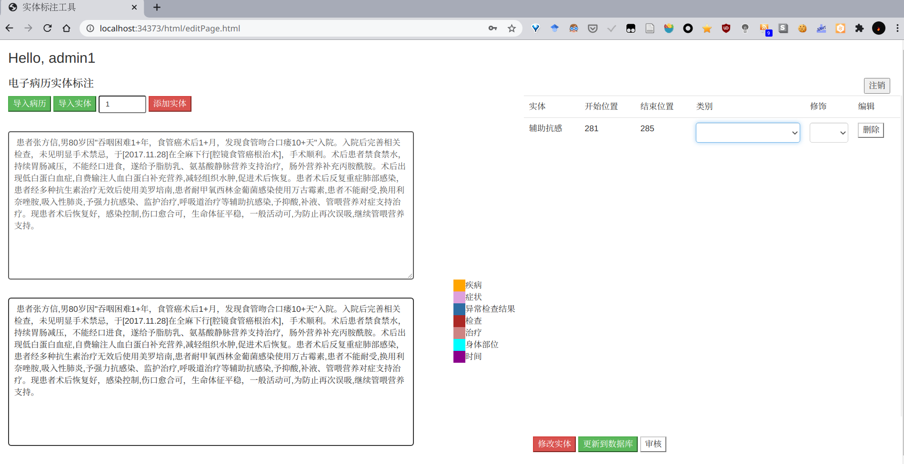

# 实体标注工具

## 简介

Flask写的一个比较简陋的标注工具，前后端分离，还有`Dockerfile`和`docker-compose.yml`。然而并没有祖传文档。

这个电子病历标注工具，应该是麦酱几年前造的轮子，之前教研室用的是这个，内部用的也没有好好写，勉强能用。

后来都去用doccano之类的开源标注工具了。

可用于电子病例等文本的实体标注识别（几年前几个师兄师姐做明命名实体识别的时候用过这个），但是界面非常简陋，功能不太多，操作也不太方便。

## 预览




## 部署使用

这几天清理阿里云的时候发现它一直在那个没人用的阿里云上跑着，都好几年了。。。


Demo演示地址：[某阿里云上海的没牌面服务器](http://139.224.54.233/html/login.html)

不过阿里云马上就到期了，以后就不提供Demo了。

只是想找一个标注工具的推荐doccano之类的，比这个好看好用得多，也一直在维护更新。

想部署着玩的用docker就行了。

```bash
git clone https://github.com/xi102/annotation_tools.git
cd annotation_tools
sudo docker-compose up -d
```

默认端口80

>[止息](https://github.com/Archaeoraptor)整理于2021.1.20
